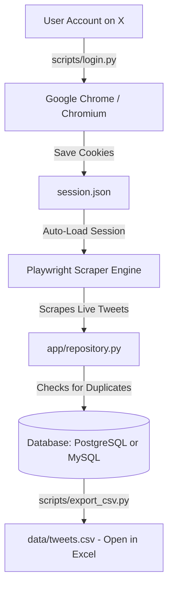

# 🐦 X (Twitter) Research Data Collector

A complete, beginner-friendly data collection and persistence pipeline designed for academic research and social data analysis. This project collects public posts (tweets) from **X (formerly Twitter)** matching any hashtag or search query (such as `#PutSouthAfricaFirst`), prevents duplicate records, securely saves the data into a database (**PostgreSQL** or **MySQL**), and allows you to export everything into an **Excel / CSV** spreadsheet with a single command.

---

## 📋 Table of Contents

- [How It Works (Code Overview)](#-how-it-works-code-overview)
- [System Requirements](#-system-requirements)
- [Quick Start for Beginners (Step-by-Step)](#-quick-start-for-beginners-step-by-step)
  - [Step 1: Open Terminal / Command Prompt](#step-1-open-terminal--command-prompt)
  - [Step 2: Create a Virtual Environment](#step-2-create-a-virtual-environment)
  - [Step 3: Install Required Dependencies](#step-3-install-required-dependencies)
- [Database Setup Guide](#-database-setup-guide)
  - [Option A: PostgreSQL Setup (Recommended & Native)](#option-a-postgresql-setup-recommended--native)
    - [Method 1: Using Docker (Fastest - 1 Command)](#method-1-using-docker-fastest---1-command)
    - [Method 2: Using pgAdmin 4 (Graphical Interface)](#method-2-using-pgadmin-4-graphical-interface)
  - [Option B: MySQL Setup (Detailed Walkthrough)](#option-b-mysql-setup-detailed-walkthrough)
    - [Method 1: Using phpMyAdmin / XAMPP (Graphical Interface)](#method-1-using-phpmyadmin--xampp-graphical-interface)
    - [Method 2: Using MySQL Workbench (Graphical Interface)](#method-2-using-mysql-workbench-graphical-interface)
    - [Method 3: Using Docker for MySQL](#method-3-using-docker-for-mysql)
- [Configuration (.env File Explained)](#-configuration-env-file-explained)
- [How to Run the Project](#-how-to-run-the-project)
  - [Phase 1: Log in Once & Save Session Cookies](#phase-1-log-in-once--save-session-cookies)
  - [Phase 2: Scrape Tweets Automatically](#phase-2-scrape-tweets-automatically)
  - [Phase 3: Export Data to Excel / CSV](#phase-3-export-data-to-excel--csv)
- [Search Query Guide (Finding What You Want)](#-search-query-guide-finding-what-you-want)
- [Exploring Your Data with SQL](#-exploring-your-data-with-sql)
  - [PostgreSQL Queries](#postgresql-queries)
  - [MySQL Queries](#mysql-queries)
- [Troubleshooting & Frequently Asked Questions (FAQ)](#-troubleshooting--frequently-asked-questions-faq)
- [Project Directory Structure](#-project-directory-structure)
- [Research Ethics & Compliance Notice](#-research-ethics--compliance-notice)

---

## 🔍 How It Works (Code Overview)

Due to recent changes on X (Twitter), the official developer API requires paid subscription plans costing hundreds of dollars per month with severe monthly tweet limits. To make academic research accessible and reliable, this project uses an advanced **browser automation pipeline**:



### Key Components Built in the Codebase:
1. **Interactive Login Helper (`scripts/login.py`)**: Opens a real Chrome browser window. You log into your X account normally, solve any two-factor (2FA) or email codes, and the script extracts your authenticated cookies into `session.json`. You only need to do this once!
2. **Stealth Playwright Scraper (`app/playwright_scraper.py`)**: Connects to Google Chrome via the Chrome DevTools Protocol (CDP on port `922`). It injects stealth scripts to bypass bot-detection, automatically navigates search pages, scrolls continuously, extracts tweet contents, timestamps, author usernames, IDs, and metrics (likes, retweets, replies, quotes).
3. **Automated Scraper CLI (`scripts/scrape_tweets.py`)**: The main command-line runner. It loads your saved session cookies, collects up to your target number of tweets (e.g., 500, 5,000, 10,000), checks the database, ignores duplicates, and tracks statistics for academic reproducibility.
4. **Persistence Layer (`app/database.py` & `app/repository.py`)**: Handles database connection pooling, auto-executes the schema on startup, and uses idempotent SQL inserts (`ON CONFLICT (tweet_id) DO NOTHING` for PostgreSQL) so that duplicate posts are never created.
5. **CSV Exporter (`scripts/export_csv.py`)**: Reads the collected tweets from the database and exports them into a clean CSV file encoded with UTF-8 BOM, meaning it opens perfectly in Microsoft Excel, Apple Numbers, or Google Sheets without broken characters.

---

## 💻 System Requirements

You do **not** need to be a programmer to run this project. You only need the following three things installed on your computer:

1. **Python (version 3.10, 3.11, or newer)**:
   - Download from [python.org/downloads](https://www.python.org/downloads/).
   - ⚠️ **CRITICAL FOR WINDOWS USERS:** When the Python installer opens, you **MUST check the box** that says **"Add Python to PATH"** before clicking Install.
2. **Google Chrome**:
   - The scraper runs with your installed Google Chrome browser. Make sure standard Chrome is installed.
3. **A Database Engine (Choose ONE)**:
   - **PostgreSQL** (Recommended - natively integrated) **OR**
   - **MySQL** (Detailed setup instructions provided below).

---

## 🚀 Quick Start for Beginners (Step-by-Step)

### Step 1: Open Terminal / Command Prompt

Open your computer's terminal and navigate into the project folder:

- **On Windows**:
  - Open the `ScrapperTweets` folder in File Explorer.
  - Click on the address bar at the top, type `cmd`, and press **Enter**. A black Command Prompt window will open directly in this folder.
- **On macOS / Linux**:
  - Open **Terminal**, type `cd ` (with a space), drag and drop your project folder into the Terminal window, and press **Enter**.

---

### Step 2: Create a Virtual Environment

A virtual environment is a private sandbox for Python so the project's packages do not interfere with the rest of your computer.

Run the following command:

```bash
# Create the virtual environment folder named .venv
python -m venv .venv
```

Now, **activate** it:

- **Windows (Command Prompt `cmd`)**:
  ```cmd
  .venv\Scripts\activate.bat
  ```
- **Windows (PowerShell)**:
  ```powershell
  .venv\Scripts\Activate.ps1
  ```
  *(If PowerShell shows a script execution error, run: `Set-ExecutionPolicy -ExecutionPolicy RemoteSigned -Scope CurrentUser` and try again).*
- **macOS / Linux**:
  ```bash
  source .venv/bin/activate
  ```

> 💡 **Tip:** When activated, you will see `(.venv)` appear at the very beginning of your terminal prompt line!

---

### Step 3: Install Required Dependencies

Run this command to install the required Python libraries:

```bash
pip install -r requirements.txt
```

Next, install the Playwright browser binaries:

```bash
python -m playwright install chromium
```

---

## 🗄️ Database Setup Guide

You can use either **PostgreSQL** or **MySQL**. Choose whichever you prefer or already have installed.

---

### Option A: PostgreSQL Setup (Recommended & Native)

PostgreSQL is the default database used by this application.

#### Method 1: Using Docker (Fastest - 1 Command)
If you have [Docker Desktop](https://www.docker.com/products/docker-desktop/) installed:
1. Make sure Docker Desktop is running.
2. In your terminal, run:
   ```bash
   docker compose up postgres -d
   ```
3. That is it! Docker automatically creates the PostgreSQL database on port `5432`, sets up the tables from `sql/schema.sql`, and keeps it running in the background.

#### Method 2: Using pgAdmin 4 (Graphical Interface)
If you installed PostgreSQL using the standard installer:
1. Open **pgAdmin 4** from your Start Menu / Applications.
2. Enter your master password to connect to the PostgreSQL server.
3. In the left sidebar, expand **Servers** -> **PostgreSQL**.
4. Right-click on **Databases** -> **Create** -> **Database...**.
5. In the **Database** field, type: `x_research` (or any name you prefer).
6. Click **Save**.
7. *(Optional)* The application automatically creates the tables when you first run the scraper. However, if you want to create them manually:
   - Right-click on your new `x_research` database -> click **Query Tool**.
   - Open the file [`sql/schema.sql`](file:///c:/Users/QuadriAkanbi/Desktop/ScrapperTweets/sql/schema.sql), copy its contents, paste into pgAdmin, and click the **Execute / Play (▶)** button.

#### PostgreSQL `.env` Settings:
Ensure your `.env` file contains:
```env
DB_HOST=localhost
DB_PORT=5432
DB_NAME=x_research
DB_USER=postgres
DB_PASSWORD=your_postgres_password_here
```

---

### Option B: MySQL Setup (Detailed Walkthrough)

If you have **MySQL** (via XAMPP, WampServer, MySQL Workbench, or Docker), follow these steps:

#### Method 1: Using phpMyAdmin / XAMPP (Graphical Interface)
1. Start **Apache** and **MySQL** in your XAMPP Control Panel.
2. Open your web browser and go to: `http://localhost/phpmyadmin`
3. Click on **New** in the left sidebar to create a database.
4. Name the database `x_research`.
5. For collation, select `utf8mb4_unicode_ci` (this supports all emojis and special characters). Click **Create**.
6. Click on your newly created `x_research` database.
7. Click the **Import** tab at the top.
8. Click **Choose File** and select [`sql/schema_mysql.sql`](file:///c:/Users/QuadriAkanbi/Desktop/ScrapperTweets/sql/schema_mysql.sql) from the project folder.
9. Scroll down and click **Import** (or **Go**).
10. All tables (`tweets` and `collection_runs`) will be created with appropriate indexes!

#### Method 2: Using MySQL Workbench (Graphical Interface)
1. Open **MySQL Workbench** and connect to your local MySQL instance (usually `localhost:3306`).
2. In the top menu, click **File** -> **Open SQL Script...**.
3. Select [`sql/schema_mysql.sql`](file:///c:/Users/QuadriAkanbi/Desktop/ScrapperTweets/sql/schema_mysql.sql).
4. At the very top of the query tab, add:
   ```sql
   CREATE DATABASE IF NOT EXISTS x_research CHARACTER SET utf8mb4 COLLATE utf8mb4_unicode_ci;
   USE x_research;
   ```
5. Click the **Execute (⚡ Lightning bolt)** icon to run the script.
6. Refresh the **Schemas** list on the left to see the `x_research` database and its tables.

#### Method 3: Using Docker for MySQL
If you prefer running MySQL inside Docker:
```bash
docker run --name mysql-x-research -e MYSQL_ROOT_PASSWORD=rootpassword -e MYSQL_DATABASE=x_research -p 3306:3306 -d mysql:8.0
```
Then import the schema:
```bash
docker exec -i mysql-x-research mysql -uroot -prootpassword x_research < sql/schema_mysql.sql
```

#### MySQL Configuration Notes:
- Standard MySQL port is `3306` (PostgreSQL is `5432`).
- Standard MySQL default administrative user is `root`.
- The MySQL schema file [`sql/schema_mysql.sql`](file:///c:/Users/QuadriAkanbi/Desktop/ScrapperTweets/sql/schema_mysql.sql) adapts PostgreSQL data types (e.g. `TIMESTAMPTZ` becomes `DATETIME`, and `SERIAL` becomes `INT AUTO_INCREMENT`).

---

## ⚙️ Configuration (`.env` File Explained)

The project reads its settings from a file called `.env` in the root folder.
If you do not have a `.env` file yet, copy `.env.example`:

```bash
# Windows
copy .env.example .env

# Mac / Linux
cp .env.example .env
```

Open `.env` with Notepad or any text editor. Here is an explanation of every setting:

```env
# ===================================================================
# Database Settings
# ===================================================================
# Where your database lives. Usually "localhost" if running on your computer.
DB_HOST=localhost

# Port number: 5432 for PostgreSQL, or 3306 for MySQL
DB_PORT=5432

# Name of the database you created in pgAdmin / MySQL
DB_NAME=x_research

# Database username: "postgres" for PostgreSQL, or "root" for MySQL
DB_USER=postgres

# The password you created when installing PostgreSQL or MySQL
DB_PASSWORD=your_database_password

# ===================================================================
# Search Query Settings
# ===================================================================
# The default search query to run if none is passed on the command line
DEFAULT_QUERY=#PutSouthAfricaFirst -is:retweet

# ===================================================================
# Browser Automation Settings (Playwright / Chrome)
# ===================================================================
# Remote debugging port for Chrome (leave default 922)
CDP_PORT=922

# Path where your authenticated login cookies will be saved
SESSION_PATH=session.json

# Optional: Path to chrome.exe if not found automatically (usually leave blank)
CHROME_PATH=

# Optional: X login credentials (used if you want automated CLI login)
X_USERNAME=
X_PASSWORD=
X_EMAIL=
```

---

## 🏃 How to Run the Project

Running the project consists of **three simple phases**:

---

### Phase 1: Log in Once & Save Session Cookies

Because X blocks automated bots from searching without an account, you must log in once.
Run this command in your terminal:

```bash
python scripts/login.py
```

#### What happens next:
1. A real Google Chrome browser window will automatically pop up.
2. The browser navigates to the X login page (`https://x.com/i/flow/login`).
3. **Log in normally**:
   - Enter your X Username / Email.
   - Enter your Password.
   - If prompted for a 2FA code, SMS code, or confirmation email, enter it.
4. Once you reach the X home feed (`x.com/home`), the script will automatically detect that you are logged in!
5. In your terminal, you will see:
   ```text
   [+] All set! Your session cookies are ready for automated scraping.
   ```
6. The browser will close and your credentials are encrypted and stored in `session.json`.

> 🔒 **Privacy Note:** Your password is never saved. Only temporary authentication session cookies are stored in `session.json` on your local computer.

---

### Phase 2: Scrape Tweets Automatically

Now that your session is saved in `session.json`, you can scrape tweets at any time without having to type your password again!

#### 1. Quick Test Run (Collect 50 Tweets):
```bash
python scripts/scrape_tweets.py --target 50
```

#### 2. Watch the Browser Scrape in Real-Time (`--visible`):
If you want to watch the browser open and scroll through tweets live on your screen:
```bash
python scripts/scrape_tweets.py --target 100 --visible
```

#### 3. Scrape a Custom Topic or Hashtag:
Use the `--query` option to search for whatever you need:
```bash
# Search for Artificial Intelligence tweets in English without retweets:
python scripts/scrape_tweets.py --query "#AI lang:en -is:retweet" --target 500

# Search for the primary research topic:
python scripts/scrape_tweets.py --query "#PutSouthAfricaFirst -is:retweet" --target 1000
```

#### 4. Scraping Output Summary Box:
When the collection finishes, the script prints a clean summary:
```text
====================================================
     Playwright Scraper - Collection Complete     
====================================================
  Query:              #PutSouthAfricaFirst -is:retweet
  Requested target:   1,000
  Tweets scraped:     1,000
  New tweets saved:   984
  Duplicates:         16
  Duration:           00:04:12
  Status:             SUCCESS
  Method:             Playwright Browser Scraping
====================================================
```
> 🛡️ **Zero Duplicates:** If you run the script multiple times, the tool automatically recognizes tweets that are already in your database and skips them, ensuring your dataset remains clean and valid.

---

### Phase 3: Export Data to Excel / CSV

Once your tweets are in the database, export them into a spreadsheet that anyone can view in Microsoft Excel, Google Sheets, or SPSS:

```bash
python scripts/export_csv.py --output data/tweets.csv
```

You can also export tweets matching only a specific search query:
```bash
python scripts/export_csv.py --output data/south_africa.csv --query "#PutSouthAfricaFirst -is:retweet"
```

#### Exported Columns:
| Column Name | Description |
| :--- | :--- |
| `tweet_id` | Unique ID of the post on X |
| `text` | Full original text of the post |
| `author_id` | Author's unique numeric ID |
| `username` | Author's handle (e.g. `@username`) |
| `created_at` | Post publication timestamp (UTC) |
| `like_count` | Number of likes on the post |
| `retweet_count` | Number of reposts/retweets |
| `reply_count` | Number of replies/comments |
| `quote_count` | Number of quote tweets |
| `lang` | Language code (e.g. `en`, `af`, `zu`) |
| `conversation_id` | Thread or conversation ID |
| `query` | The search term used to find this post |
| `collected_at` | Timestamp when the scraper saved the record |

---

## 🔎 Search Query Guide (Finding What You Want)

You can customize the `--query` parameter using X's standard search operators:

| Operator | Example | Description |
| :--- | :--- | :--- |
| `#hashtag` | `#PutSouthAfricaFirst` | Match posts containing the hashtag |
| `phrase` | `"South Africa"` | Match the exact phrase |
| `-is:retweet` | `#topic -is:retweet` | Exclude retweets (keeps only original posts) |
| `OR` | `(#tag1 OR #tag2)` | Match either term |
| `lang:` | `lang:en` | Filter by language (`en` = English, `af` = Afrikaans, etc.) |
| `from:` | `from:elonmusk` | Posts from a specific user |
| `min_faves:` | `min_faves:10` | Only posts with at least 10 likes |
| `since:` / `until:` | `since:2024-01-01 until:2024-02-01` | Filter by date range |

**Example Combinations:**
```bash
# Original posts containing either hashtag in English
python scripts/scrape_tweets.py --query "(#PutSouthAfricaFirst OR #PutSouthAfricaFirstMovement) -is:retweet lang:en" --target 1000

# Popular posts about climate change
python scripts/scrape_tweets.py --query "#ClimateAction min_faves:25 -is:retweet" --target 500
```

---

## 📊 Exploring Your Data with SQL

You can query your database directly using **pgAdmin** (PostgreSQL) or **phpMyAdmin / MySQL Workbench** (MySQL).

### PostgreSQL Queries

```sql
-- 1. Total number of posts collected
SELECT COUNT(*) AS total_posts FROM tweets;

-- 2. Posts collected per day
SELECT DATE(created_at) AS post_date, COUNT(*) AS total_posts
FROM tweets
GROUP BY DATE(created_at)
ORDER BY post_date DESC;

-- 3. Top 10 most liked tweets
SELECT username, like_count, retweet_count, text
FROM tweets
ORDER BY like_count DESC
LIMIT 10;

-- 4. Posts grouped by language
SELECT lang, COUNT(*) AS count
FROM tweets
GROUP BY lang
ORDER BY count DESC;

-- 5. Collection runs history
SELECT run_id, query, started_at, posts_fetched, posts_inserted, duplicates, status
FROM collection_runs
ORDER BY started_at DESC;
```

### MySQL Queries

```sql
-- 1. Total number of posts collected
SELECT COUNT(*) AS total_posts FROM tweets;

-- 2. Posts collected per day
SELECT DATE(created_at) AS post_date, COUNT(*) AS total_posts
FROM tweets
GROUP BY DATE(created_at)
ORDER BY post_date DESC;

-- 3. Top 10 most liked tweets
SELECT username, like_count, retweet_count, text
FROM tweets
ORDER BY like_count DESC
LIMIT 10;

-- 4. Overall engagement summary
SELECT
    COUNT(*) AS total_posts,
    SUM(like_count) AS total_likes,
    SUM(retweet_count) AS total_retweets,
    ROUND(AVG(like_count), 2) AS average_likes
FROM tweets;
```

---

## 🛠️ Troubleshooting & Frequently Asked Questions (FAQ)

### Q1: When running PowerShell, I get an error: "File cannot be loaded because running scripts is disabled on this system."
**Solution:** Windows PowerShell restricts scripts by default. Run this command once in PowerShell:
```powershell
Set-ExecutionPolicy -ExecutionPolicy RemoteSigned -Scope CurrentUser
```
Then try activating your virtual environment again: `.venv\Scripts\Activate.ps1`.
Alternatively, use the standard Windows **Command Prompt (`cmd`)**.

---

### Q2: I get `ModuleNotFoundError: No module named 'playwright'` (or any other package name).
**Solution:** This means your virtual environment is either not activated or the packages are not installed yet. Run:
```bash
# 1. Activate environment
.venv\Scripts\activate

# 2. Install packages
pip install -r requirements.txt
```

---

### Q3: Database error: `psycopg2.OperationalError: connection to server at "localhost" failed`
**Solution:**
1. Make sure your PostgreSQL server is actually running (in Windows Services or Docker).
2. Check your `.env` file:
   - Is `DB_PORT` set to `5432`?
   - Is `DB_PASSWORD` set to your actual database password?
   - Does the database `x_research` exist in pgAdmin?

---

### Q4: Google Chrome does not open or says "Could not find Google Chrome or Chromium".
**Solution:**
1. Ensure standard Google Chrome is installed on your machine.
2. If Chrome is installed in an unusual location, add its path to your `.env` file:
   ```env
   CHROME_PATH=C:\Program Files\Google\Chrome\Application\chrome.exe
   ```

---

### Q5: Can I re-run the login script if my session expires?
**Solution:** Yes! Simply force a fresh login with:
```bash
python scripts/login.py --force
```

---

### Q6: Can I pause or safely stop the scraper while it is running?
**Solution:** Yes! Press **`Ctrl + C`** in your terminal. The script will intercept the signal, save any tweets already collected up to that point, commit them to your database, update the run status, and shut down cleanly.

---

## 📁 Project Directory Structure

```text
ScrapperTweets/
│
├── app/
│   ├── __init__.py
│   ├── config.py              # Reads configuration from .env
│   ├── database.py            # Manages PostgreSQL connections & auto-schema
│   ├── logging_config.py      # Structured terminal & file logging
│   ├── models.py              # Tweet and CollectionRun data structures
│   ├── playwright_scraper.py  # Anti-bot Playwright Chrome scraper engine
│   └── repository.py          # Database queries & idempotent insertions
│
├── scripts/
│   ├── login.py               # One-time interactive browser login & cookie saver
│   ├── scrape_tweets.py       # Main automated tweet collection CLI
│   └── export_csv.py          # Exports database records to Excel/CSV
│
├── sql/
│   ├── schema.sql             # PostgreSQL table schema & indexes
│   └── schema_mysql.sql       # MySQL table schema & indexes
│
├── tests/
│   └── test_core.py           # Automated unit tests
│
├── .env.example               # Template configuration file
├── docker-compose.yml         # 1-click Docker setup for PostgreSQL
├── Dockerfile                 # Container build definition
├── requirements.txt           # Python library dependencies
├── session.json               # Saved browser login cookies (auto-generated)
└── README.md                  # Comprehensive documentation
```

---

## ⚖️ Research Ethics & Compliance Notice

This software is designed exclusively for academic research, sociological studies, and educational analysis of public discourse.

- **Public Data Only:** This tool collects only publicly visible posts on X. It does not access private accounts, direct messages, or non-public personal information.
- **Academic Responsibility:** Researchers using this tool are responsible for complying with:
  - Applicable platform Terms of Service and developer guidelines.
  - Institutional Review Board (IRB) or university ethics committee requirements.
  - Applicable data-privacy regulations (e.g., GDPR in the EU, POPIA in South Africa, CCPA in the US).
- **Security:** Never commit your `.env` file, database credentials, or `session.json` file to public repositories like GitHub.
